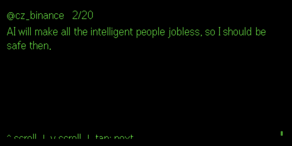

# X for Even Realities G2

Scroll your X (Twitter) home timeline on your Even Realities G2 smart glasses.

Navigate with the temple touchpad or R1 ring:
- Scroll down/up - move through tweet pages
- Scroll again at the boundary - jump to next/previous tweet
- Single tap - jump to next tweet
- Double tap - refresh the feed



## Running in beta

This app isn't published to Even Hub yet, so you'll need to sideload it yourself. No coding required - just get your API keys and load the app.

### 1. Get your X API credentials

Go to [developer.twitter.com](https://developer.twitter.com) and create a project + app. You need **Read** permissions enabled.

From your app's "Keys and Tokens" page, grab:
- Consumer Key (API Key)
- Consumer Secret (API Secret)
- Access Token
- Access Token Secret

### 2. Sideload the app

Download `out.ehpk` from the [latest release](https://github.com/sommohapatra/x-for-even-g2/releases) and drag it into [hub.evenrealities.com](https://hub.evenrealities.com) to install it on your glasses.

### 3. Connect your account

On first launch, the app will show a setup screen on your phone. Enter your four API keys and tap Connect. Your credentials are stored only on your device and used to fetch your personal timeline.

That's it.

---

## Local dev

```bash
git clone https://github.com/sommohapatra/x-for-even-g2.git
cd x-for-even-g2
npm install
npx vercel dev   # runs frontend + API on localhost:3000
```

Arrow keys scroll tweets, Enter jumps to next tweet, R refreshes. The setup form will appear on first run - enter your keys there, or clear `localStorage` to reset.
